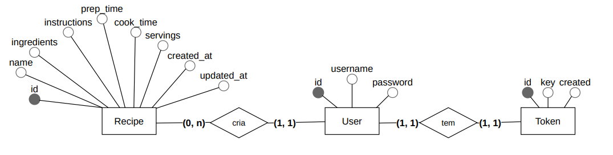

# Autor
- [Stephen Dias Barreto](https://www.linkedin.com/in/stephenbarreto/)

# Recipes API

Uma API simples para gerenciar receitas. Com ela é possível criar, listar, atualizar e excluir receitas.
Todos os usuários podem visualizar as receitas, mas apenas os usuários autenticados(chefs) podem criar, atualizar e excluir receitas.



## Tecnologias Utilizadas

**Back-end:** [Python](https://www.python.org/), [Django](https://www.djangoproject.com/), [Django-Rest-Framework](https://www.django-rest-framework.org/)

**Front-end:** [drf-spectacular](https://github.com/tfranzel/drf-spectacular)

## Instalação

1. Verifique se o [Python](https://www.python.org/downloads/) está instalado. Você pode baixá-lo no site oficial do Python: https://www.python.org/downloads/
2. Clone o repositório executando o seguinte comando:
```bash
git clone https://github.com/stephenbarreto/recipe_api.git
```
3. Navegue até o diretório do projeto:
```bash
cd recipe_api
```
4. Crie um ambiente virtual::
* Linux
```bash
python -m pip install virtualenv
python -m venv venv
source venv/bin/activate
```
* Windows
```bash
python -m pip install virtualenv
python -m venv venv
.\venv\Scripts\activate
```
5. Instale os pacotes necessários:
```bash
pip install -r requirements.txt
```
6. Configure o banco de dados:
```bash
python manage.py makemigrations
python manage.py migrate
```
7. Crie uma conta de superusuário para acessar o painel de administração:
```bash
python manage.py createsuperuser
```
8. Execute o servidor de desenvolvimento:
```bash
python manage.py runserver 8000
```

## Acesso

Agora que tudo está instalado e configurado, clique no link abaixo ou insira a URL em seu navegador.

http://127.0.0.1:8000/

## Documentação da API

### URL API: https://recipe-api-sigma.vercel.app/

#### [POST] /chefs/create/

Descrição: Cadastrar um chef

Corpo da requisição:
```json
{
    "username": "stephen@ifnmg.edu.br",
    "password": "senha123"
}
```

Exemplo de Resposta:
```json
{
    "id": 1,
    "username": "stephen@ifnmg.edu.br",
    "token": "55d80c341f5636f58f24f8dbe120f6748f4d19f3"
}
```

#### [GET] /recipes/

Descrição: Listar todas as receitas

Parâmetros:
- name: Filtrar receitas por nome
- chef_username: Filtrar receitas por chef

Exemplo de filtro: 

/recipes/?chef_username=stephen@ifnmg.edu.br

Exemplo de Resposta:
```json
[
    {
        "id": 1,
        "name": "Bolo de Cenoura",
        "ingredients": "Cenoura, Ovo, Óleo, Açúcar, Farinha de Trigo, Fermento em Pó",
        "instructions": "Bata no liquidificador a cenoura, os ovos e o óleo, até formar uma mistura homogênea. Em seguida, adicione o açúcar e bata novamente. Despeje a mistura em uma tigela e adicione a farinha de trigo e o fermento em pó. Misture bem. Despeje a massa em uma forma untada e leve ao forno preaquecido a 180°C por 40 minutos.",
        "chef": "stephen@ifnmg.edu.br",
        "created_at": "2021-08-29T20:00:00Z",
        "updated_at": "2021-08-29T20:00:00Z",
        "description": "Bolo de cenoura fofinho e saboroso",
        "prep_time": "00:40:00",
        "cook_time": "00:40:00",
        "servings": 8
    }
]
```

#### [POST] /recipes/

Descrição: Cadastrar uma receita

Corpo da requisição:
```json
{
    "name": "Bolo de Cenoura",
    "ingredients": "Cenoura, Ovo, Óleo, Açúcar, Farinha de Trigo, Fermento em Pó",
    "instructions": "Bata no liquidificador a cenoura, os ovos e o óleo, até formar uma mistura homogênea. Em seguida, adicione o açúcar e bata novamente. Despeje a mistura em uma tigela e adicione a farinha de trigo e o fermento em pó. Misture bem. Despeje a massa em uma forma untada e leve ao forno preaquecido a 180°C por 40 minutos.",
    "description": "Bolo de cenoura fofinho e saboroso",
    "prep_time": "00:40:00",
    "cook_time": "00:40:00",
    "servings": 8
}
```

Exemplo de Resposta:
```json
{
    "id": 1,
    "name": "Bolo de Cenoura",
    "ingredients": "Cenoura, Ovo, Óleo, Açúcar, Farinha de Trigo, Fermento em Pó",
    "instructions": "Bata no liquidificador a cenoura, os ovos e o óleo, até formar uma mistura homogênea. Em seguida, adicione o açúcar e bata novamente. Despeje a mistura em uma tigela e adicione a farinha de trigo e o fermento em pó. Misture bem. Despeje a massa em uma forma untada e leve ao forno preaquecido a 180°C por 40 minutos.",
    "chef": "stephen@ifnmg.edu.br",
    "created_at": "2021-08-29T20:00",
    "updated_at": "2021-08-29T20:00",
    "description": "Bolo de cenoura fofinho e saboroso",
    "prep_time": "00:40:00",
    "cook_time": "00:40:00",
    "servings": 8
}
```

#### [GET] /recipes/{id}/

Descrição: Visualizar uma receita

Parametros:
- id: ID da receita

Exemplo de Requisição:
/recipes/1/

Exemplo de Resposta:
```json
{
    "id": 1,
    "name": "Bolo de Cenoura",
    "ingredients": "Cenoura, Ovo, Óleo, Açúcar, Farinha de Trigo, Fermento em Pó",
    "instructions": "Bata no liquidificador a cenoura, os ovos e o óleo, até formar uma mistura homogênea. Em seguida, adicione o açúcar e bata novamente. Despeje a mistura em uma tigela e adicione a farinha de trigo e o fermento em pó. Misture bem. Despeje a massa em uma forma untada e leve ao forno preaquecido a 180°C por 40 minutos.",
    "chef": "stephen@ifnmg.edu.br",
    "created_at": "2021-08-29T20:00",
    "updated_at": "2021-08-29T20:00",
    "description": "Bolo de cenoura fofinho e saboroso",
    "prep_time": "00:40:00",
    "cook_time": "00:40:00",
    "servings": 8
}
```

#### [PUT] /recipes/{id}/

Descrição: Atualizar uma receita

Parametros:
- id: ID da receita

Exemplo de Requisição:
/recipes/1/

Corpo da requisição:
```json
{
    "name": "Bolo de Cenoura",
    "ingredients": "Cenoura, Ovo, Óleo, Açúcar, Farinha de Trigo, Fermento em Pó",
    "instructions": "Bata no liquidificador a cenoura, os ovos e o óleo, até formar uma mistura homogênea. Em seguida, adicione o açúcar e bata novamente. Despeje a mistura em uma tigela e adicione a farinha de trigo e o fermento em pó. Misture bem. Despeje a massa em uma forma untada e leve ao forno preaquecido a 180°C por 40 minutos.",
    "description": "Bolo de cenoura fofinho e saboroso",
    "prep_time": "00:40:00",
    "cook_time": "00:40:00",
    "servings": 8
}
```

Exemplo de Resposta:
```json
{
    "id": 1,
    "name": "Bolo de Cenoura",
    "ingredients": "Cenoura, Ovo, Óleo, Açúcar, Farinha de Trigo, Fermento em Pó",
    "instructions": "Bata no liquidificador a cenoura, os ovos e o óleo, até formar uma mistura homogênea. Em seguida, adicione o açúcar e bata novamente. Despeje a mistura em uma tigela e adicione a farinha de trigo e o fermento em pó. Misture bem. Despeje a massa em uma forma untada e leve ao forno preaquecido a 180°C por 40 minutos.",
    "chef": "stephen@ifnmg.edu.br",
    "created_at": "2021-08-29T20:00",
    "updated_at": "2021-08-29T20:00",
    "description": "Bolo de cenoura fofinho e saboroso",
    "prep_time": "00:40:00",
    "cook_time": "00:40:00",
    "servings": 8
}
```

#### [DELETE] /recipes/{id}/

Descrição: Excluir uma receita

Parâmetros:
- id: ID da receita

Exemplo de Requisição:
/recipes/1/

Status da Resposta: 204 No Content

#### Token de Acesso

##### 572ac72bfc0cef2a54ee719b1772ba772b117a1b


### Teste você mesmo

[](http://127.0.0.1:8000/api/schema/swagger-ui/#/)
[](https://recipe-api-sigma.vercel.app/api/schema/swagger-ui/#/)

Para explorar a documentação completa da API, visite [https://recipe-api-sigma.vercel.app/api/schema/swagger-ui/#/](http://127.0.0.1:8000/api/schema/swagger-ui/#/). Esta página fornece detalhes sobre endpoints, parâmetros e permite testar interativamente vários recursos oferecidos pela API.

Certifique-se de ter o servidor em execução localmente para acessar a documentação.
